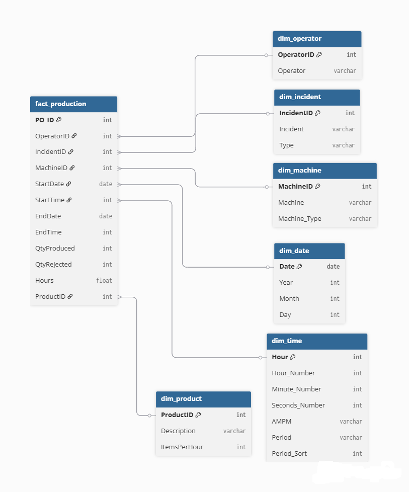
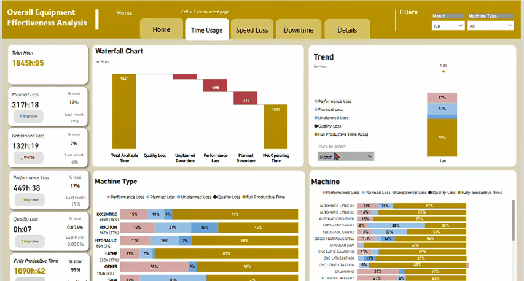

READ ME : lam xong thi xem lai consulting thinking (problem solving framework + 1 casestudy da lam)

# Overall Equipment Effectiveness (OEE) Dashboard

This project focuses on developing a comprehensive OEE dashboard to evaluate and improve manufacturing line performance. The dashboard will provide insights into production efficiency, time utilization, and machine reliability, enabling stakeholders to identify bottlenecks and optimize operations.

## Problem Statement

- Context: 
    - Manufacturing line performance is not transparent across shifts, machines, and downtime events 
    - and fragmented across systems (MES, maintenance logs, quality reports).
- Who can use the report: 
    -Production Manager , Plant Manager , Planners
- Core Problem: 
    - Inability to identify true bottlenecks and loss drivers (availability, performance, quality)

- Objective (from core problem)
    - Measure and decompose OEE
    - Identify top loss drivers
    - Evaluate machine performance reliability

- Questions to answer (from objectives)
    - Core Questions : “Where is time lost, why is it lost, and what should we fix first?”

    - Group 1 "Overall": Measure and decompose OEE
        - What is the current OEE % across machines and shifts?
        - Which component is the dominant loss driver to OEE%? 
    
    - Group 2 "Time Usage Decomposition": Identify top loss drivers 
        - Which machine contributes most to downtime (availability loss)/ performance loss (slow cycles)/ quality loss (defects)?
        - What are the main causes of downtime and production losses?
        - Which machines & shifts have best and worst time utilization (full productive time)?

    - Group 3 "Reliability": Evaluate machine performance reliability
        - Which machines have the highest MTBF (most reliable)?
        - Which machines have the lowest MTTR (fastest recovery)?

    

## KPI logic

This section defines the key performance indicators (metrics) used in the OEE dashboard. For detailed information about each metric, calculation methodology, and business logic, refer to [Metric Dictionary](docs/Metric%20Dictionary.md).

## Data Model

The data structure and schema that supports the OEE dashboard. For a comprehensive breakdown of all data fields, their definitions, and relationships, refer to [Data Dictionary](docs/Data%20Dictionary.md).

The Entity Relationship Diagram (ERD) below illustrates the data model structure:

## Data dictionary

See [Data Dictionary](docs/Data%20Dictionary.md) for complete documentation of all data fields and structures.

## Dashboard Preview

The OEE dashboard consists of multiple interactive views:

- **HomePage.gif** - Overview and main dashboard view

- **Details.gif** - Detailed machine performance metrics

- **TimeUsage.gif** - Time utilization breakdown analysis

- **Downtime.gif** - Downtime events and causes analysis

- **SpeedLoss.gif** - Performance loss and cycle time analysis

